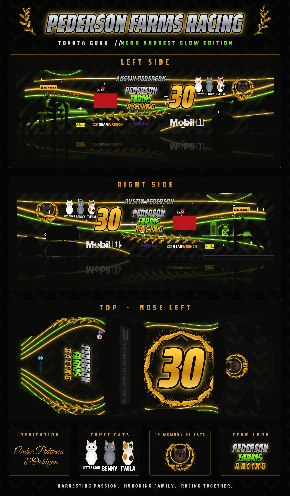

# Pederson Farms Racing: Toyota GR86 paint ("Neon Harvest Glow")

A black, neon gold and lime livery for the iRacing **Toyota GR86**, made on the official iRacing GR86 template.



The views are the real painted panels cut out of the template, so they match the TGA exactly. [Template layout](output/preview_wire.png)

## Put it in iRacing

1. Download `output/car_CUSTID.tga` and `output/car_spec_CUSTID.tga`.
2. Rename both, replacing `CUSTID` with your iRacing customer ID (it's in iRacing under Account):
   `car_123456.tga` and `car_spec_123456.tga`
3. Copy them to `Documents\iRacing\paint\toyotagr86\` on your PC (create the folder if it's missing).
4. In iRacing, set your car number to **30** and pick **Sim-stamped number**. The sim prints it on the red GR Cup number panel ahead of the door.
5. To see it: load a test drive, or in the replay/garage press **Ctrl+R** to reload paints.

The spec map (`car_spec_…`) gives the gold parts a metallic shine and keeps the black base glossy. It's optional.

Other people only see your paint if you upload it through Trading Paints.

## What's on it

- **Sides:** AUSTIN PEDERSON over the door, the PEDERSON / FARMS / RACING logo, a big gold 30 on the rear door, and a wheat garland along the rocker. The front fender has the glowing barn and silo with "Amber Pederson & Oaklynn". The rear quarter has Little Man, Benny and Twila plus the "In Memory of Tate" badge.
- **Hood:** team logo with wheat garlands and neon lines running to the headlights.
- **Roof:** gold 30 inside a wheat wreath.
- **Trunk:** Tate's memorial badge.
- **Base:** black with a faint tractor-tread texture.

The GR Cup sponsor decals from iRacing's template (Mobil 1, Continental and the others) are kept, as the series requires.

## Change it

```
pip install pillow numpy psd-tools
python make_paint.py --id 123456
```

Run `python showcase.py` afterwards to redraw the poster. This rebuilds everything in `output/`, with your ID already in the file names. On the first run it downloads the official template from iRacing.
