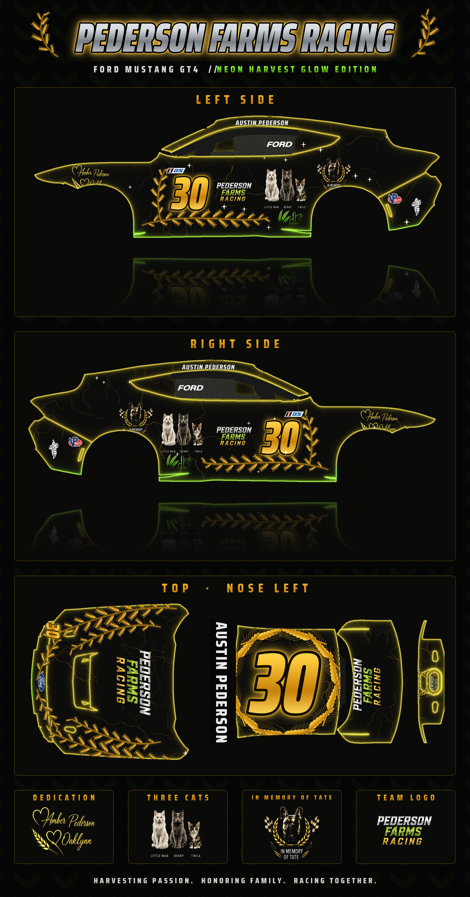

# Pederson Farms Racing: Ford Mustang GT4 paint ("Neon Harvest Glow")

Your concept art as a real iRacing paint, built on the official iRacing Mustang GT4 template.



The views are the real painted panels cut out of the template, so they match the TGA exactly. [Template layout](output/preview_wire.png)

**3D preview** (a mock-up on a stand-in sports car, see `render3d/`): [render_3d.jpg](output/render_3d.jpg)

## Put it in iRacing

1. Download `output/car_CUSTID.tga` and `output/car_spec_CUSTID.tga`.
2. Rename both, replacing `CUSTID` with your iRacing customer ID: `car_123456.tga` and `car_spec_123456.tga`.
3. Copy them to `Documents\iRacing\paint\fordmustanggt4\` on your PC. Check the exact folder name there first; if it's different, use that folder.
4. The 30s are painted on, as in the concept (the IMSA number plates were removed). In iRacing's paint screen, turn off the sim-stamped number so it doesn't add a second one.
5. Load a test drive, or press **Ctrl+R** in the garage or replay to reload paints.

The spec map is optional. It makes the gold metallic and keeps the black glossy.

Other people only see your paint if you upload it through Trading Paints. Only Trading Paints Pro shows your painted-on numbers to others.

## What's on it (from the concept)

- **Sides:** a gold 30 inside a wheat frame, the PEDERSON / FARMS / RACING logo, and Little Man, Benny and Twila. The "In Memory of Tate" badge sits over the rear wheel, the farm scene (in lime) is low on the rear door, and the "Amber Pederson ♡ Oaklynn" dedication is on the front fender. AUSTIN PEDERSON runs over the window.
- **Front:** the team logo on the hood, wheat sprays along both hood edges and around the nose, and a 30 on the bumper corner.
- **Windshield banner:** AUSTIN PEDERSON.
- **Roof:** a gold 30 in a wheat wreath.
- **Rear:** the team logo on the decklid, Tate between the taillights, and a 30 plus a PF shield on the bumper. The tractor-tread texture is on the diffuser.
- **Wing:** PEDERSON FARMS RACING.
- **Everywhere:** a black base with gold veins, and every panel edge glows gold. The edges turn neon lime along the rockers and splitter.

The cats, Tate, the dedication, the farm, the tread and the logo come straight from your concept (`assets/`). The small series stickers (Michelin, IMSA, Motul, VP) are kept.

## Change it

```
pip install pillow numpy psd-tools scipy
python make_paint.py --id 123456
python showcase.py
```

It uses the shared drawing helpers in `../pederson-farms-gr86/`, and downloads the official template on first run.
